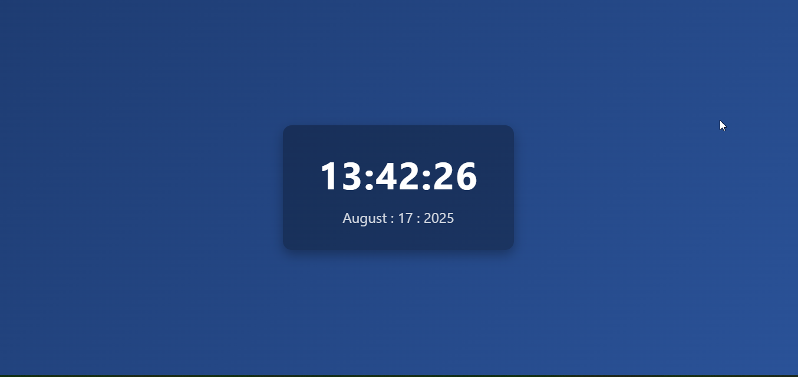

# ⏰ Digital Clock

A simple **Digital Clock** built with **HTML, CSS, and JavaScript**.  
The clock updates in real-time and displays the current hours, minutes, and seconds.

---

## 📸 Preview


---

## 🚀 Features
- Displays the current time in **HH:MM:SS** format.
- Updates automatically every second.
- Simple and clean user interface.
- Responsive layout (works on desktop & mobile).

---

## 🛠️ Tech Stack
- **HTML5** – structure  
- **CSS3** – styling  
- **JavaScript (Vanilla JS)** – functionality  

---


---

## 📖 How It Works
1. The `index.html` file sets up the layout (a clock container with a `<div>` for the time).  
2. The `styles.css` file centers the clock and styles the text.  
3. The `main.js` file:
   - Gets the current time using `Date()`.
   - Formats hours, minutes, and seconds.
   - Updates the clock every 1000ms (1 second) using `setInterval`.

---

## 🏃‍♂️ Run Locally
1. Clone the repo:
   ```bash
   git clone https://github.com/mutheeDavid12/js-weekend-project.git

