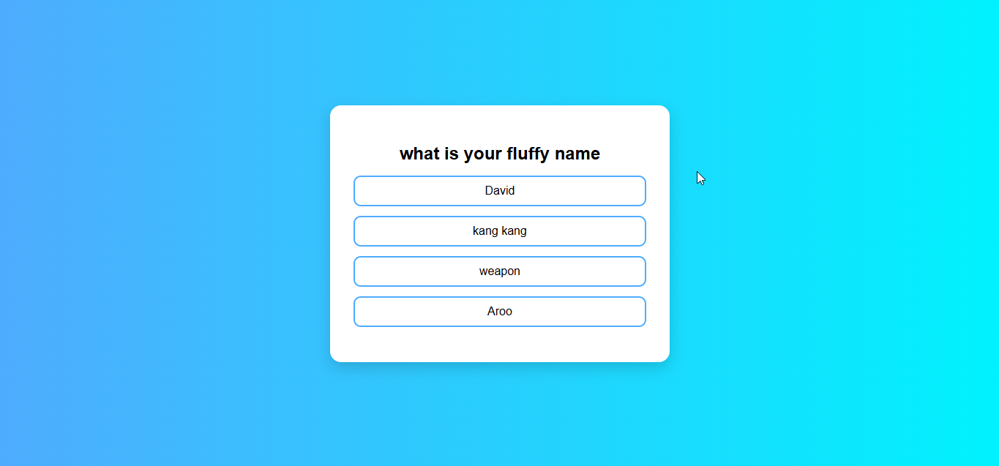
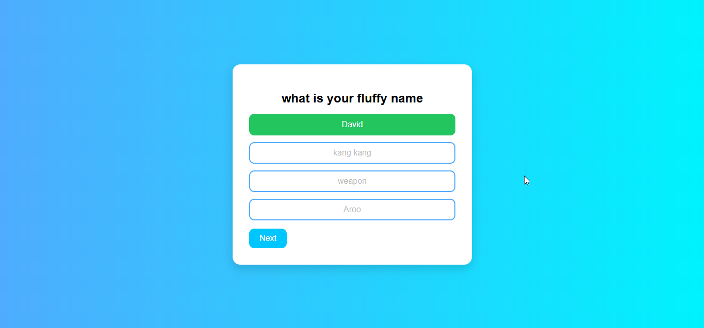
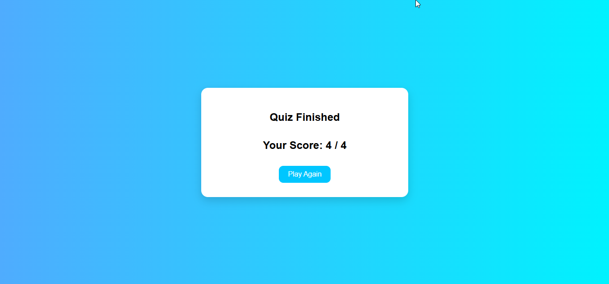

# Quiz App 📝

A simple interactive quiz application built with **HTML, CSS, and JavaScript**.  
The app allows users to answer multiple-choice questions, keeps track of their score, and displays the result at the end.

---

## 📸📸 Screenshots

## 📌 Features
- Simple and clean quiz interface  
- Multiple-choice questions  
- Tracks score in real-time  
- Displays results after the last question  
- "Restart Quiz" option  

---

## 🛠️ Technologies Used
- **HTML5** – Structure of the quiz  
- **CSS3** – Styling and layout  
- **JavaScript (ES6)** – Logic and interactivity  

---

