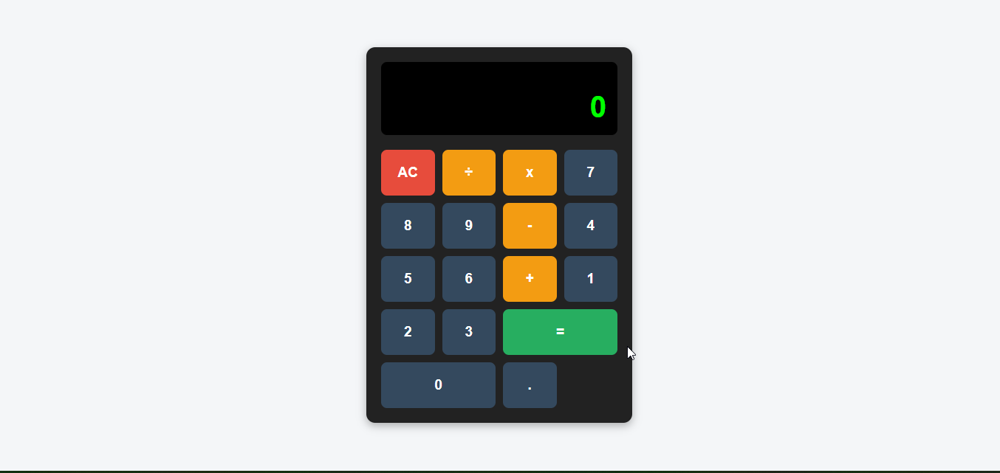

# 🧮 Calculator App

A simple calculator built with **HTML**, **CSS**, and **JavaScript**.  
This app allows users to perform basic arithmetic operations such as **addition, subtraction, multiplication, and division**.

---

## 🚀 Features

- Clean and responsive calculator UI.
- Perform basic math operations:
  - ➕ Addition
  - ➖ Subtraction
  - ✖️ Multiplication
  - ➗ Division
- Clear button to reset calculations.
- Real-time display updates as you type.

---

## 

## 🛠️ Technologies Used

- **HTML5** – for the structure
- **CSS3** – for styling and layout
- **JavaScript (ES6)** – for calculator logic

---

## ⚡ How to Run

1. Clone the repository:
   ```bash
   git clone https://github.com/your-username/js-weekend-projects.git
   ```
