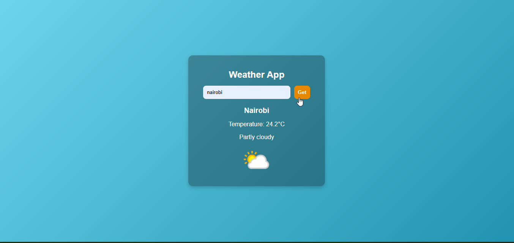

# Weather App 🌤️

A simple weather application that fetches and displays real-time weather data for any city using the **OpenWeatherMap API**.

---

## 🚀 Features
- Search for weather by **city name**.
- Displays:
  - 🌡️ Temperature (Celsius / Fahrenheit option optional)
  - 🌦️ Weather condition (clear, rain, clouds, etc.)
  - 💨 Wind speed
  - 💧 Humidity
- Clean and responsive UI.

---


---

## ⚡ Getting Started

### 1. Clone the repository
```bash
git clone https://github.com/your-username/js-weekend-projects.git
cd js-weekend-projects/weather-app
